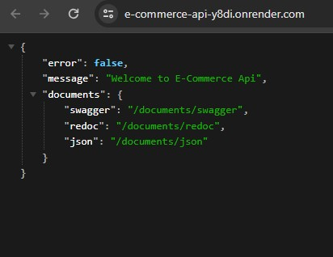

# E-commerce Backend

E-commerce-app is a project that you can see products and you can add product to your basket and buy products. When you buy products you can see them in your purchases. To see the frontend repo you can visit [E-commerce Frontend](https://github.com/Hasan-Turkel/ecommerce-next)  

## [Click to see live link](https://e-commerce-api-y8di.onrender.com)

## This is how the site looks like.

